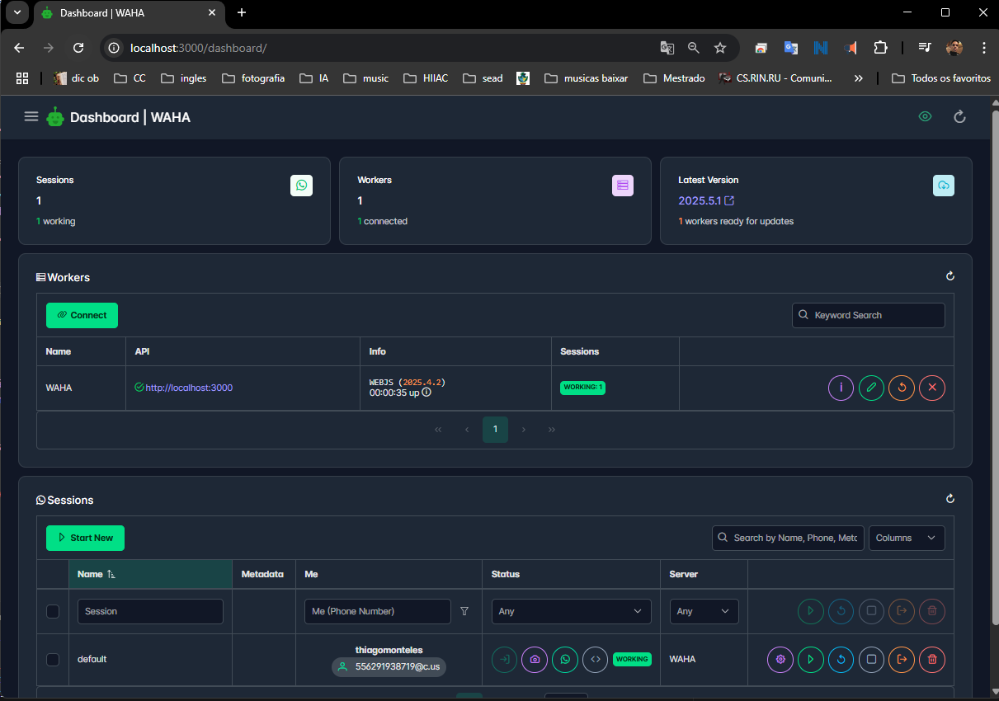
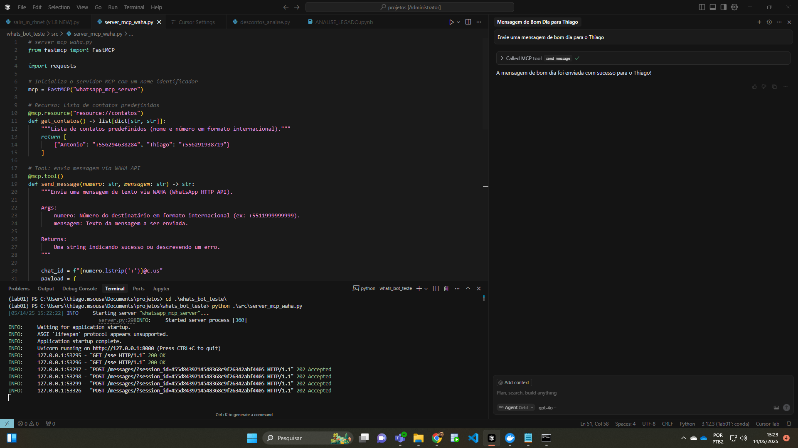
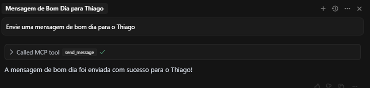

 MCP WhatsApp Server com WAHA

Este repositório contém um servidor MCP em Python integrado ao WAHA para envio de mensagens no WhatsApp via protocolo Model Context Protocol.

Feito para matérioa de Tópicos Avançados em IA Generativa - INF/UFG


## Estrutura do projeto

- `src/server_mcp_waha.py`: código do servidor MCP com tool `send_message` e resource `contatos`.
- `.cursor/mcp.json`: configuração para clientes MCP (exemplo: Cursor).

## Requisitos

- Python 3.8+
- Docker (para rodar WAHA)
- Bibliotecas Python: `fastmcp[cli]`, `requests`

## Instruções para rodar

1. Subir o WAHA via Docker:

   ```bash
   docker pull devlikeapro/waha
   docker run -it --rm -p 3000:3000 --name waha devlikeapro/waha

acesse em http://localhost:3000/dashboard/

  
   
Acesse http://localhost:3000/dashboard no navegador e escaneie o QR code com o WhatsApp para autenticar.
   
2. Execute o servidor MCP:

   ```bash
   python src/server_mcp_waha.py

2.Configure o cliente MCP (exemplo: Cursor) para conectar ao servidor no endereço:
  Configurado no mcp.json
   ```bash
   http://127.0.0.1:8000/sse
```

3. Agora basta abrir o cliente e enviar prompt pedidno para enviar uma mensagem para um contato (salvo na Recurso: lista de contatos predefinidos ou numero +55....)




